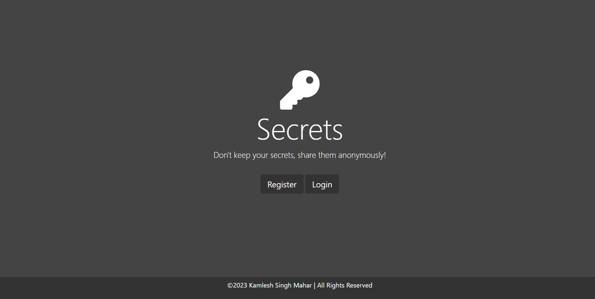

# Secrets Website using level 6 securiy "OAuth" sign up with google.

Secrets Website using level 6 security using OAuth sign up with google.

"A captivating website where users can anonymously share their deepest secrets, allowing a sense of catharsis and connection. To bolster security at the highest level (Level 6), Implementation, OAuth authentication with Google, ensuring user trust and data protection. Making the design both attractive and intriguing, drawing users in for a better experience.".

How to run the code ?

- Get the project by either downloading it or forking it.

- Navigate to the project directory on your computer, and in your terminal, execute the command 'npm i' to install all the necessary dependencies for this project.

- Launch your project by running the command 'nodemon app.js' in your terminal using nodemon.

# Screenshot
project screenshot :

screenshot 2:

